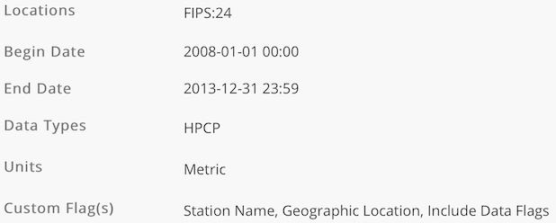

```{r setup, include=FALSE}
knitr::opts_chunk$set(echo = TRUE)
# knitr::opts_chunk$set(eval = FALSE)
```

## Introduction

### The Question

Can we use precipitation data to predict the orthophosphate levels in bodies of water?

### Motivation

#### Orthophosphate

You are probably wondering:

* What is orthophosphate? (Sounds like a mouthful!)
* Why should I care about the orthophosphate levels in water?

Orthophosphate is known as reactive phosphate and is a main ingredient in fertilizer. Basically, this stuff makes living stuff grow; it's a nutrient that is "readily utilized by biota". When it rains, orthophosphates can get into bodies of water through run-off [@soltis-muth].

In biology terms, an excess of nutrients can lead to eutrophication. You should care because this phenomenon is something bad for the environment and humans.

#### Eutrophication

_Wth great nutrients comes a whole lot of algae. (And responsibility as I'll explain!)_

Wow, another big word in the title! Here is a brief simplified overview of what eutrophication is.

1) Nutrients causes growth of a lot of plants and algae who then die.
2) Bacteria decomposing the dead stuff use up all the oxygen which then **suffocates animals** in the water.

There are many other problems such as an increase in pH that is associated with algae blooms [@chislock_doster_zitomer_wilson_2013].

Let's backtrack. Nutrients in run-off that came from fertilizers played a part in this catastrophe. So be careful, mindful, and responsible when you use fertilizers!

Still not convinced to care? I conceed that I have not discussed how this affects humans.

* If you eat any kind of shellfish, you should definitely care. Some algae have toxins that make it into shellfish! [@shumway_1990]
* While cyanobacteria are not algae, it can be involved in a similar process with cyanobacteria blooms. This has been shown to cause an increase in "**non-alchoholic liver disease**" in humans! [@zhang_lee_liang_shum_2015]

#### What can we do?

* We have concluded that algae blooms can be bad for the environment and humans.
* We know there is a link between orthophosphate and algae growth.
* We know orthophosphate is found in fertilizers and run-off happens during rain.

My motivation for investigating _The Question_ is that: if we can predict orthophosphate levels using weather, perhaps we can limit the damaging effects of these blooms.

## Data Acquisition

### Finding Data

Getting data is no easy task for data scientists.

Often times if one has data, one has to clean or scrape that data. Other times one does not have data and has to spend hours finding suitable data. (Sometimes it is both.)

For this task, I spent many hours (possibly 6 or more) before I found data that was both good quality and was related to a good question!

At first I looked across different dataset repositories such as https://www.data.gov. I did not have any luck until I came across AWS open data: https://registry.opendata.aws.

Some candidate datasets I considered using were:

* eBird data
    * https://registry.opendata.aws/ebirdst/
    * https://cornelllabofornithology.github.io/ebirdst/
    * This is some data on birds.
    * This would be a good topic since birds play a very important role in the environment. They play a role in pollinating.
    * I found that this data was ready to use as a package was available in R already.
    * Some issues I ran into were that the data seemed mostly to be raster/image data. I was unsure how to manipulate these.
    * Also, the numerical data seemed to be related to model accuracy for some pre-defined model. Since I would like to analyze data itself, this would not be very helpful.

* Finnish (and HIRLAM) data
    * https://registry.opendata.aws/hirlam/
    * https://en.ilmatieteenlaitos.fi/open-data-on-aws-s3
    * From these links I eventually found some vague description of that the Finnish Meteorological Institute had time series data. That got me very excited.
    * After some digging, I found their catalog of data.
    * http://catalog.fmi.fi/geonetwork/srv/eng/catalog.search#/home
    * I mostly found dense XML data and was left confused.
    * Their website was, of course, primarily in Finnish. Setting the language to English and using Google Translate only helped a little. Maybe I should have looked at the data on AWS instead.

* Multimedia Commons (YFCC100M)
    * https://registry.opendata.aws/multimedia-commons/
    * https://multimediacommons.wordpress.com/yfcc100m-core-dataset/
    * The Multimedia Commons is an add-on dataset to the YFCC dataset. It provides pre-extracted features for images and audio.
    * We did not learn much about image processing. So this would be a great dataset to use as the features are ready to use. (They're actually still working on finishing the dataset.)
    * However, the original YFCC dataset required some kind of request for it. Since I did not want to wait, I did not choose this dataset.
    * Another issue was that many extracted features were in some LIRE format. I found it hard to understand the documentation.
    * And for features like SIFT not in this format, I struggled to find R libraries for image related machine learning. I would also have had to write a binary file parser in R.

Although AWS open data is a great place for data, the amount became overwhelming; I spent much of my time looking there. Unfortunately, I did not find any data of my liking.

These were just some of the datasets I found **not suitable**.

### The Data

I decided to search a bit more local. Perhaps the county or state government would have some good data. Indeed I found good data on Maryland's open data: https://opendata.maryland.gov.

I ended up settling with the **Water Point Source Sample** data:

https://opendata.maryland.gov/Energy-and-Environment/Water-Point-Source-Sample-Results/eqs6-savc

Now all I needed was **precipitation data**. Since I now knew exactly what I was looking for, I found it pretty quickly. I will also be using data from NOAA's Climate Data Online:

https://www.ncdc.noaa.gov/cdo-web/

https://www.ncdc.noaa.gov/cdo-web/datasets

The documentation can be found here:

https://www1.ncdc.noaa.gov/pub/data/cdo/documentation/PRECIP_HLY_documentation.pdf

I will have included both datasets in my Github repository. If you wish to go through the process yourself, here are the details.

This is a free dataset but we still have to "order" it. The steps to obtain this dataset are as follows:

1) Go to the search tool: https://www.ncdc.noaa.gov/cdo-web/search. Enter the following into the search form:
    * Precipitation Hourly
    * 2008-01-01 to 2013-12-31
    * States
    * Maryland
2) Submitting will take you to a map. Find the "add to cart" button on the left sidebar.
3) Hover over the cart on the right upper hand corner and click "go to cart".
4) Check everything is in order and click continue _until_ prompted for _station details/flags_. Since more data cannot hurt, check all the options (station name, geographic location, and data flags). **Make sure to switch the units from standard to metric.** (This actually requires some knowledge ahead of time. Our primary data is in metric.)
5) You definitely should check _Precipitation_ for data types. Click continue.
6) Again, check everything is in order, enter your email address and submit.
7) You will receive a link to download the data.

Your parameters should look something like the following.



## Working With Data

Now that we have found the data, it is a good idea to load them. It will help in describing the data when the metadata is not clear.

### Required Packages

First, I will define what packages you'll need. It is helpful to know this at the start.

```{r import_stuff, warning=FALSE, message=FALSE}
# tibble related libraries
library(tidyverse)
library(tidyr)
# date processing
library(lubridate)
# string manipulation
library(stringr)
# map capabilities
library(leaflet)
```

### Loading Data

**Water Point Source Sample**

```{r loading_data}
# do not worry about this, explanation is in the data description
m_types <- cols(
  `Org Name` = col_character(),
  `Station ID` = col_character(),
  County = col_character(),
  HUC = col_double(),
  `Station Horizontal Datum` = col_character(),
  `Activity ID` = col_character(),
  `Activity Start` = col_character(),
  `Activity Medium` = col_character(),
  `Activity Type` = col_character(),
  `Activity Category-Rep Num` = col_character(),
  `Characteristic Name` = col_character(),
  `Sample Fraction` = col_character(),
  `Value Type` = col_character(),
  `Result Value Status` = col_character(),
  `Result Value` = col_double(),
  Units = col_character(),
  `Analytical Proc ID` = col_character(),
  `Location 1` = col_character(),
  Counties = col_double()
)

water_df <- read_csv("Water_Point_Source_Sample_Results.csv",
                     col_types = m_types) %>%
  # parse the strings into date objects
  # format is month day year hours:minutes:seconds
  mutate(the_date = mdy_hms(`Activity Start`))
```

**NOAA Precipitation**

```{r load_noaa}
# do not worry about this, explanation is in the data description
m_types <- cols(
  STATION = col_character(),
  STATION_NAME = col_character(),
  ELEVATION = col_double(),
  LATITUDE = col_double(),
  LONGITUDE = col_double(),
  # here the data is in this format: year-month-day hours:minutes:seconds
  DATE = col_datetime(format = "%Y%m%d %H:%M"),
  HPCP = col_double(),
  `Measurement Flag` = col_character(),
  `Quality Flag` = col_character()
)

rain_df <- read_csv("precipitation.csv", col_types = m_types)
```

## Description of Dataset

I am using two datasets. The primary data (with our "target" orthophosphate attribute) is **Water Point Source Sample** data and the auxillary data is **NOAA Precipitation** data.

### Water Point Source Sample

This biggest issue with this dataset is that the metadata only includes the suggested data type (that may or may not be correct). The only two types listed are "text" and "number".

Without any description, I have to either infer or do analysis to gain more context. We will see below that there is much pre-analysis even before exploratory data analysis.

```{r}
water_df %>% head()
```

As you can see below, there are 163,574 samples.

```{r}
water_df %>% count()
```

Below you can see that all samples are taken on the first day of every month for 5 years (There are 60 distinct dates and 60 / 12 = 5).

```{r}
water_df %>%
  group_by(the_date) %>%
  summarize(samples = n())
```

#### Org Name

_Data Type: Text_

The organization name. This is not particularly interesting since all the samples are under "Maryland Point data". I will definitely be dropping this column.

(This attribute name is somewhat of a misnomer since the value isn't really an organization.)

```{r}
water_df %>%
  group_by(`Org Name`) %>%
  summarize(samples = n())
```

#### Station ID

_Data Type: Nominal Categorical_

The unique identifier of the station. There are a total of 272 stations.

```{r}
water_df %>%
  group_by(`Station ID`) %>%
  summarize(samples = n()) %>%
  arrange(desc(samples))
```

#### County

_Data Type: Nominal Categorical_

The county in Maryland that the station is located in.

You can see below the number of samples in the data for each county. There are some listed as unspecified that might need to be filtered out.

```{r desc_county, rows.print=100}
water_df %>%
  group_by(`County`) %>%
  summarize(samples = n()) %>%
  arrange(desc(samples))
```


#### HUC

_Data Type: Nominal Categorical_

[see @usgs_water_2018]

* Hydrologic Unit Code
* You can think of this as a zipcode but for bodies of water.
* This code is the concatentation of multiple codes. For example, the first two digits signify the "major geographical region" the water body is in. (For this dataset, a zero may need to be padded at the beginning for this to be true.)

#### Station Horizontal Datum

_Data Type: Nominal Categorical_

[see @geodesy_2004]

* This is the version of the geodetic datum being used. This has something to do with the shape of the Earth.
* The system is a "collection of specific points on the Earth".
* NAD27 is the outdated version and NAD83 is the newer version.

As you can see below, there are no stations that explicitly use NAD27 but there are some unknown entries that might need to be filtered out.

```{r}
water_df %>%
  group_by(`Station Horizontal Datum`) %>%
  summarize(samples = n())
```

#### Activity ID

_Data Type: Nominal Categorical_

This attribute was not documented well. So I will first provide some preliminary analysis for determining its purpose.

You can see below that the activity ID does not uniquely identify any particular observation. Recall there are 163,574 samples but here we only see 16,167 IDs.

```{r}
water_df$`Activity ID` %>% n_distinct()
```

Let's look at the most frequent activity IDs.

```{r}
act_id_samples <- water_df %>%
  group_by(`Activity ID`) %>%
  summarize(samples = n())

act_id_samples %>%
  arrange(desc(samples)) %>%
  head()
```

Well that didn't tell us much. What about the least frequent?

```{r}
tmp <- act_id_samples %>%
  arrange(samples) %>%
  head()

tmp
```

I have saved the result in a variable. Since there is only one of each, I can safely look at the all the observations for each without being flooded with data.

```{r}
water_df %>%
  # selects samples where the activity ID is in the table previously generated
  filter(`Activity ID` %in% tmp$`Activity ID`) %>%
  # these are not very useful so I excluded them
  select(-`Org Name`, -`Station Horizontal Datum`)
```

These samples look all exactly the same except for the station ID and activity ID. (Based on some attributes not shown.) We will see later that the "outfall" stations are again "troublemakers".

I now believe the activity ID may be related to the station ID. Below I find the number of unique activity IDs each station uses.

```{r}
water_df %>%
  group_by(`Station ID`) %>%
  summarize(num_unique = n_distinct(`Activity ID`))
```

I know where I have seen 60 before! Recall this is the total number of unique sampling dates. There are some anomalies such as 36 or 61 unique activity IDs. (From data not shown.)

Just to make sure, I find the number of activity IDs used by stations in 2009 below. I am expecting each station to use 12 activity IDs in a year.

```{r}
water_df %>%
  filter(year(the_date) == 2009) %>%
  group_by(`Station ID`) %>%
  summarize(num_unique = n_distinct(`Activity ID`))
```

I picked 2009 based on that there was a full year of data. It seemed "safe" compared to 2008 which does not have a full year of data (the data starts July 2008).

At this point, I am almost satisfied. Let's list what we observed:

* Each activity ID is used anywhere from 1 to 13 times.
* Different activity IDs could be the same "activity" with the same results.
* Each station used roughly 60 activity IDs in the span of 5 years.
* Each station used roughly 12 activity IDs in 2009.

I actually had first arrived at a false conclusion. I do not state it and to correct myself requires some future knowledge:

* There are 13 characteristic names (types of measurements).

I pick an arbitrary station, the first of the previous output, and analyze how many activity IDs it used.

```{r act_char_desc, rows.print=100}
water_df %>%
  filter(year(the_date) == 2009, `Station ID` == "MD0000311") %>%
  group_by(`Activity ID`) %>%
  summarize(num_unique = n_distinct(`Characteristic Name`))
```

The above output shows that for each of the 12 IDs the station used, each were used 13 times (the same number as the number of characteristics).

I conclude that it is most probable that:

Each activity ID is used by a single station for a particular sampling day. For any sampling date, you can link all the characteristics collected by the same station (on that date) using the activity ID.

(I might drop this column since we'll only be looking at the characteristic "orthophosphate".)

#### Activity Start

_Data Type: Date_

This is the date of when the sample was taken. As mentioned before, samples are taken the first day of each month. There are 5 years of data and so there are 60 days where samples were taken.

I have converted this attribute to a date and will use the new attribute "the_date" in place of this.

#### Activity Medium

_Data Type: Nominal Categorical_

The medium or substance we are testing for characterstics within. In this case we are only testing aspects of water so this is not very interesting. You can see below that the only medium is water. (This column will be dropped.)

```{r}
water_df %>%
  group_by(`Activity Medium`) %>%
  summarize(samples = n())
```

#### Activity Type

_Data Type: Nominal Categorical_

The type of activity being performed. In this case, we have data of routine sampling of water. As you can see below, the only type is "Sample-Routine". (This column will be dropped.)

```{r}
water_df %>%
  group_by(`Activity Type`) %>%
  summarize(samples = n())
```

#### Activity Category-Rep Num

_Data Type: Nominal Categorical_

This column appears to be a duplicate of "Activity Type". From the name, it appears that there should be numerical values.

However, as you can see below, we only have "Sample-Routine" as the sole value. Therefore, I have marked this as text data.

```{r}
water_df %>%
  group_by(`Activity Category-Rep Num`) %>%
  summarize(samples = n())
```

The metadata does not help other than saying this contains text. Without context, I cannot deduce what this attribute is for. (This column will be dropped.)

#### Characteristic Name

_Data Type: Nominal Categorical_

This is the characteristic or aspect of the water being measured. For example, there are samples with measurements for dissolved oxygen in water.

You can see below the number of samples for each characteristic name.

```{r desc_char_name, rows.print=100}
water_df %>%
  group_by(`Characteristic Name`) %>%
  summarize(samples = n())
```

#### Sample Fraction

_Data Type: Nominal Categorical_

Describes what kind of "fraction" the measurement is of. For example, some measurements such as dissolved oxygen only measure the fraction of dissolved oxygen in the water.

You can see below the number of samples for each kind of sample fraction.

```{r}
water_df %>%
  group_by(`Sample Fraction`) %>%
  summarize(samples = n())
```

#### Value Type

_Data Type: Nominal Categorical_

As you can see below, the only value this attribute takes is "Actual". My best guess is that there could of been values that are estimates.

It seems that I should take the name of this attribute at face value. This attribute simply describes the type of value that is in "Result Value". (Type as in observed vs estimated, etc.)

(I will be dropping this column.)

```{r}
water_df %>%
  group_by(`Value Type`) %>%
  summarize(samples = n())
```

#### Result Value Status

_Data Type: Nominal Categorical_

As you can see below, the only value this attribute takes is "Final". Again, it seems that this attribute should be taken at face value.

This attribute describes the status of the "Result Value" and indicates whether the "Result Value" is fully processed or needs processing.

(I will be dropping this column.)

```{r}
water_df %>%
  group_by(`Result Value Status`) %>%
  summarize(samples = n())
```

#### Result Value

_Data Type: Continuous Numerical_

This attribute is the measured/observed value.

For example, if a sample is measuring the dissolved oxygen characteristic, the corresponding value is a quantative value of the amount of dissolved oxygen.

#### Units

_Data Type: Nominal Categorical_

The units the "Result Value" is measured in.

Below you can see the two units used are "mg/l" and "mgd".

```{r}
water_df %>%
  group_by(`Units`) %>%
  summarize(samples = n())
```

#### Analytical Proc ID

_Data Type: Nominal Categorical_

My best guess is that this attribute is the "Analytical Process ID". Without context, I cannot deduce what this attribute is for. (This column will be dropped.)

As you can see below, the only value is "MDPOINTSOURCE~MDE-DMR".

```{r}
water_df %>%
  group_by(`Analytical Proc ID`) %>%
  summarize(samples = n())
```

Here is what I have gathered so far. Looking at the "~" delimeter, on the left is the name of this dataset "MD POINT SOURCE" and on the right is "MDE-DMR".

MDE might stand for the Maryland Department of Environment:

https://mde.maryland.gov/Pages/index.aspx

DMR might stand for _discharge monitoring report_ and I actually found another dataset (which I won't be using because it's out of scope of this "tutorial"):

https://echo.epa.gov/tools/data-downloads/icis-npdes-dmr-and-limit-data-set

#### Location 1

_Data Type: Geolocation_

After reviewing a few latitude + longitude coordinates on maps, I am fairly certain that this is the location of the station itself (rather than where the sample of the body of water was taken).

Below is a few examples of the format. Parsing will be needed.

```{r}
water_df %>%
  group_by(`Location 1`) %>%
  summarize(samples = n())
```

#### Counties

_Datatype: Discrete Numerical_

This column was not included/listed in the metadata. The name is vague. Without context, I cannot deduce what this attribute is for.

Regardless, I will at least attempt a guess. Counties seems to have something to do with "County". The table below counts the number of samples for each County and Counties pair.

```{r}
water_df %>%
  group_by(County, Counties) %>%
  summarize(samples = n())
```

The table above has not given me much more insight. I do see that there are NA values for Counties. (From data not shown.) To the best of my knowledge, it is safe to drop this column.

### NOAA Precipitation

Unlike the Water Point Source Sample data, the NOAA Precipitation data does have very good documentation as linked in _Data Acquisition_ under _The Data_ [@noaa_precip].

Below is a preview of the data.

```{r}
rain_df %>% head()
```

As you can see below, there are 13,533 samples.

```{r}
rain_df %>% count()
```

One last important thing to note: According to the documentation, only hours when rain occurred are entered into this dataset [@noaa_precip].

#### STATION

_Data Type: Nominal Categorical_

Cooperative identification number. This attribute uniquely identifies a station.

The table below shows the number of samples that each station has contributed to the dataset. There are 7 stations in total.

```{r}
rain_df %>%
  group_by(STATION) %>%
  summarize(samples = n())
```

#### STATION_NAME

_Data Type: Nominal Categorical_

According to the documentation, this is: "A name identifying the station location" [@noaa_precip].

The table below shows the number of samples associated with each station name in the dataset. There are 7 stations names in total and this matches up with the stations.

```{r}
rain_df %>%
  group_by(STATION_NAME) %>%
  summarize(samples = n())
```

#### ELEVATION

_Data Type: Continuous Numerical_

As the name of this attribute suggests, this is the elevation above sea level.

#### LATITUDE

_Data Type: Geolocation_

The latitude geographic coordinate of the station.

#### LONGITUDE

_Data Type: Geolocation_

The longitude geographic coordinate of the station.

#### DATE

_Data Type: Date_

The date that the measurement ended.

We might run into a"logical" problem here since the last measurment possible in the day is "00:00" [@noaa_precip]. The issue may arise if we are trying to perform operations grouped by the entire day.

#### HPCP

_Data Type: Continuous Numerical_

The amount of precipitation that the station measured. This value is cummulative. Since we asked for metric, this is in tenths of millimeters. Lastly, missing values are 99999 [@noaa_precip].

#### Measurement Flag

_Data Type: Nominal Categorical_

Indicates potential problems or characteristics of the measurement. For example, "M" is for missing data and "g" is used for the very first entry. This is empty if "no flag is needed" [@noaa_precip].

#### Quality Flag

_Data Type: Nominal Categorical_

Indicates characteristics of the quality of measurment. For example, "R" indicates that one of the "NCDC's quality control tests" failed [@noaa_precip].

## Data Pre-processing

I will be detailing my data management. I will be discussing missing data.

My goals after processing the data is as follows:

* The water sample data should include only the orthophosphate characterstic data and non-redundant attributes.
* The precipitation data should have a new attribute that is the monthly mean cummulative rain (for hours it did rain) for each station.

### Water Point Source Sample

The first thing I will do is filter so we'll only have the orthophosphate characterstic. I'll go ahead and also drop the columns I said I would definitely drop.

```{r}
ortho_df <- water_df %>%
  filter(`Characteristic Name` == "Orthophosphate") %>%
  # note I am dropping this name because we already know it
  select(-`Characteristic Name`,
         -`Org Name`,
         -`Activity Medium`,
         -`Activity Type`,
         -`Activity Category-Rep Num`,
         -`Value Type`,
         -`Result Value Status`,
         -`Analytical Proc ID`,
         -`Counties`,
         # dropping this because we already have it parsed as "the_date"
         -`Activity Start`)
```

Another column I suspect we can drop is sample fraction.

```{r}
ortho_df %>%
  group_by(`Sample Fraction`) %>%
  summarize(samples = n())
```

As you can see above, this is no longer telling us any additional information. I drop the column below.

```{r}
ortho_df <- ortho_df %>% select(-`Sample Fraction`)
```

The last thing I will do before missing data is parse the longitude and latitude. Note that I am still keeping "Location 1" as comparing doubles for exact match is not as easy as strings.

```{r}
ortho_df <- ortho_df %>%
  mutate(loc1 = str_sub(`Location 1`, start = 9)) %>%
  separate(loc1, c("lat","lng"), sep = ",") %>%
  mutate(lat=as.numeric(str_replace(lat, "\\(", ""))) %>%
  mutate(lng=as.numeric(str_replace(lng, "\\)", "")))

ortho_df %>%
  select(`Station ID`, lat, lng) %>%
  head()
```

At this point we can start handling missing data.

I saved the process of handling missing data until the now because filtering and dropping unnecessary columns first can simplify this process. (You could be handling missing data that wouldn't even be there afterwards!)

Of course I had to be careful with filtering. Imputing the mean after filtering can have very different results compared to the reverse. I only filtered for the "orthophosphate" characteristic. This does not affect with values like the mean value for that particular characteristic.

I analyze the attributes in two batches so the results fits in the page.

```{r}
ortho_df %>%
  summarize(sta_id_na = sum(is.na(`Station ID`)),
            county_na = sum(is.na(County)),
            huc_na =sum(is.na( HUC)),
            datum = sum(is.na(`Station Horizontal Datum`)),
            act_id_na = sum(is.na(`Activity ID`)))
```

For this set of attributes, I see there are 6 samples with the HUC (hydrologic unit code)  NA. I am not too worried as I do not plan to use this in my final predictor.

```{r}
ortho_df %>%
  summarize(date_na = sum(is.na(the_date)),
            res_val_na = sum(is.na(`Result Value`)),
            unit_na = sum(is.na(`Units`)),
            lat_na = sum(is.na(lat)),
            lng_na = sum(is.na(lng)))
```

If you recall in the data description, I found there were NAs that were in character format. Below I investigate.

```{r}
ortho_df %>% filter(`Station Horizontal Datum` == "UNKWN")
```

```{r}
ortho_df %>% filter(County == "UNSPECIFIED")
```

It looks like this all goes back to the HUC. Recall there there were 6 samples with HUC as NA. Let's see if we can drop these two stations altogether.

```{r}
ortho_df %>% filter(`Station ID` == "MD0066184")
```

```{r}
ortho_df %>% filter(`Station ID` == "MD0022993")
```

It seems that these stations each only have 3 data points. This will not be enough for our predictor anyway. (I plan to use data across the 5 years.) I remove these stations below.

```{r}
ortho_df <- ortho_df %>%
  filter(!(`Station ID` %in% c("MD0066184", "MD0022993")))
```

So far I like this data! From the results above, it seems there is almost no missing data (we will see that this is not true for the precipitation dataset).

### NOAA Precipitation

The very first thing to look at for this dataset is the Measurment Flag and Quality Flag. According to NOAA's documentation, some data is imprecise, missing, or "indicators". Some rows are simply just telling us when the rain began! (No value associated.)

Below we can see that some rows have the quality flag "R".

```{r noaa_data_pre}
rain_df %>%
  group_by(`Quality Flag`) %>%
  summarize(samples = n())
```

As mentioned in the data description, "R" indicates the measurment failed a NCDC quality control test.

As stated prior, my plan is to use the average of the accumulated rain only for hours when it rained for each month.

The noise from this data should be negligble because there are only 34 samples and we are computing the average over a month. Thus, I will disregard this flag.

Let's begin constructing our transformed data. I will begin by dropping the quality flag column.

```{r}
rain_tidy <- rain_df %>% select(-`Quality Flag`)
```


Now onto the measurement flag. We can see below that over a quarter of the data has some special flag.

```{r}
rain_tidy %>%
  group_by(`Measurement Flag`) %>%
  summarize(samples = n())
```

Let's tackle the easiest first. As just mentioned, I only want to average the hours when it does rain. According to the documentation, "T" is for trace amounts. I will consider this as not raining. Below I remove these rows.

```{r}
rain_tidy <- rain_tidy %>%
  # notice that we want to keep NAs
  # the added condition overrides the default filter behavior
  filter(`Measurement Flag` != "T" | is.na(`Measurement Flag`))
```

The flag "g" is also fairly simple. The documentation says this is used on the first day when accumulations starts and the value is 0 [@noaa_precip]. Below I remove these rows.

```{r}
rain_tidy <- rain_tidy %>%
  # notice that we want to keep NAs
  # the added condition overrides the default filter behavior
  filter(`Measurement Flag` != "g" | is.na(`Measurement Flag`))
```

According to the documentation, "a" indicates when accumulation begins and "A" indicates when accumulation ends. There is no data associated when the flag is "a" and 99999 for "A" indicates "the accumulation continues into the next month" [@noaa_precip].

Since the "a/A" flags only have 7 entries, I can just manually take a look. What I am concerned about is accumulation across months.

```{r noaa_measure_a, rows.print=100}
rain_tidy %>%
  # the filter condition is true if measurement flag is "a" or "A"
  filter(`Measurement Flag` %in% c("a", "A")) %>%
  select(STATION, DATE, HPCP, `Measurement Flag`)
```

Oh no! If you look at the table above, the value is 25399.75 instead of 99999! Was the documentation wrong? Nope, it was just that when we asked for metric data, it divided _everything_. The original units were hundredth inches which is approximately 3.9 tenth millimeters (our current unit).

The good news is none of these carry into another month! Hurray! Let's just drop the non-data "a" rows.

```{r}
rain_tidy <- rain_tidy %>%
  # notice that we want to keep NAs
  # the added condition overrides the default filter behavior
  filter(`Measurement Flag` != "a" | is.na(`Measurement Flag`))
```

The next is a little bit tricky. There is missing data encoded with "\{\}" and "[]". This can be painful to process because these are intervals with two rows that indicate the start and stop.

What is really interesting is that not all the "[]" match! From a table above, there are 182 "[" but 184 "]". My guess is that since we ordered a subset of the data, the extra "]" are ending the missing data from earlier (not in our subset).

Recall that I mentioned earlier that I want to compute some mean within a month.

Missing data is not problem if there are data points within that month. I can just impute the mean.

But if my end goal is to get the mean itself, then I can drop these rows! (Since the whole point of imputing the mean is to have the mean stay the same.)

The trickier problem comes if the data has a complete month missing. I want to do this "mean computation" for each month. If there is no data, then the mean itself is missing too!

In this case, I will look across years for that month and impute the mean from the mean of the other means! (I am assuming that a month, say January, will have similar weather over the years.)

Now we've reached a problem where we need to deal with dates. Recall that in the data description the "DATE" attribute is the _end_ date. However, we run into the problem for edge cases where the measurement is taken at 12AM.

Ideally, we would want this rain data to count for the data before. (The rain happened and then the results were in once the clocked turned 12AM). Below we can see that this case indeed exists in our data.

```{r}
rain_tidy %>%
  filter(hour(DATE) == 0) %>%
  select(STATION, DATE, HPCP, `Measurement Flag`)
```

There are 601 of these rows! Note that the POXIX format does not show the hour when the time is exactly on the start of the day (12AM).

The simplest solution is just to add a column for the starting date which I perform below.

```{r}
rain_tidy <- rain_tidy %>% mutate(start_date = (DATE - hours(1)))

rain_tidy %>%
  select(STATION, DATE, start_date, HPCP) %>%
  head()
```

Now let's get back to the missing data.

To see if there is actually some data that is not missing in a month, we can add a logical flag (0 or 1) for if that data is _not_ missing. Then if we group and sum, the only possible value when _all_ the data is missing is 0.

Note that when I say month, I am actually abbreviating for: a particular year's month for a particular station.

```{r}
rain_tidy <- rain_tidy %>%
  # we consider the data not to be missing if the flag is NA
  # or if the flag is not one of the missing flags
  mutate(not_missing = (is.na(`Measurement Flag`) |
                          !(`Measurement Flag` %in% c("{", "}", "[", "]"))
                        )) %>%
  group_by(STATION, year(start_date), month(start_date)) %>%
  mutate(num_not_missing = sum(as.numeric(not_missing))) %>%
  ungroup() %>%
  # We only need to keep if num_not_missing is 0 since
  # those are the samples we cannot compute the mean for.
  # If num_not_missing != 0, we will implicitly handle this when
  # we estimate the mean.
  # (Recall that our "estimate" mean then would be missing.)
  filter(not_missing | num_not_missing == 0)
```

The above code looks complex but all it does is handle dropping all the missing data we can safely drop.

Let's see how much data were in the second case: where the entire month of data was missing for that station!

```{r}
rain_tidy %>%
  group_by(`Measurement Flag`) %>%
  summarize(samples = n())
```

Wow, that's quite a lot of stations with **entire months of missing data**!

Now I will compute the mean across all months for each station. I know there are 7 stations, 12 months in a year. So I expect 7 \* 12 = 84 rows.

```{r}
mean_df <- rain_tidy %>%
  filter(not_missing) %>%
  group_by(STATION, month(start_date)) %>%
  summarize(avg = mean(HPCP)) %>%
  rename(month = `month(start_date)`)

mean_df
```

Indeed we do get 84 rows. This is good. No station was super bad. We can deduce they all collected data for any month at least once in the span of 5 years.

We have everthing we need to start making the final summarized data. I am expecting 7 stations, 12 months in a year, and a span of 5 years.

7 \* 12 \* 6 = 504! So I expect 504 rows once we are done.

Let's first construct a table with all the combinations. This will be the "skeleton" and tell use which values are implicitly missing

```{r}
station_ids <- rain_tidy %>% distinct(STATION)
month_span <- seq(from = 1, to = 12)
year_span <- seq(from = 2008, to = 2013)

rain_final <- crossing(station_ids, month_span, year_span) %>%
  rename(month = month_span, year = year_span)

rain_final
```

Now let's compute what would have been our final table.

```{r}
final_with_missing <- rain_tidy %>%
  filter(not_missing) %>%
  group_by(STATION, year(start_date), month(start_date)) %>%
  summarize(avg = mean(HPCP)) %>%
  rename(year = `year(start_date)`, month = `month(start_date)`)

final_with_missing
```

The code above computes the monthly mean (average) precipitation for the hours that rained for each station.

As you can see, there are only 305 rows! That is so much less than 504! We are missing much data. However, I am in too deep and we press forward.

There would be no way to tell which combinations were missing had we not generated the "skeleton". Below I perform a left join to make the implicitly missing data, explicit.

```{r}
rain_final <- rain_final %>%
  left_join(final_with_missing,
            by=c("STATION" = "STATION",
                 "year" = "year",
                 "month" = "month"))

rain_final
```

As you can see, station COOP:180465 had missing data on January 2012. Now all we have to do is impute the missing data.

First I will perform another left join so we can refer to the "global" month average. Remember we computed the mean_df before? Now we use it.

```{r}
rain_final <- rain_final %>%
  left_join(mean_df %>% rename(global_avg = avg),
            by = c("STATION" = "STATION", "month" = "month"))

rain_final %>% head()
```

We're in the endgame now! The final step is easy. We just need to replace if the avg is NA.

```{r}
rain_final <- rain_final %>% mutate(avg = if_else(is.na(avg), global_avg, avg))

rain_final %>% head()
```

As you can see above, we've essentially "borrowed" the value over from global_avg when avg was NA. For sanity check, let's make sure we still have 504 rows in our final table!

```{r}
rain_final %>% count()
```

## Exploratory Data Analysis

### Water Point Source Sample

What I became immediately curious about was how these stations were distributed across Maryland. I provide a map below.

```{r map_stuff}
map <- ortho_df %>%
  distinct(lat, lng, `Station ID`) %>%
    leaflet() %>%
    addTiles() %>%
    addMarkers(lng = ~lng,
               lat = ~lat,
               popup = ~`Station ID`,
               clusterOptions = markerClusterOptions())

map
```

This distribution looks good! It seems we are covering many of the waters in Maryland.

One thing I noticed that was peculiar was that just a few stations were at the same. It was very subtle but I'm glad I caught it! I investigate this below.

```{r}
ortho_df %>%
  distinct(`Location 1`, `Station ID`) %>%
  group_by(`Location 1`) %>%
  summarize(count = n()) %>%
  arrange(desc(count))
```

As you can see above, there are 4 "different stations" occupying the same geolocation!

Below, we can see the Station IDs for these peculiar stations.

```{r}
ortho_df %>%
  filter(`Location 1` == "MARYLAND\n(38.583333, -77.157778)" |
           `Location 1` == "MARYLAND\n(39.359167, -76.370556)") %>%
  distinct(`Station ID`, `Location 1`)
```

I looked up outfall. Basically it is water leaving a facility. My best guess is that these are for the multiple ways water can exit for some facility. I will worry about this when I have to (later).

#### Clustering

I will do some unsupervised learning with k-means clustering. I would like to know what regions are similar in their orthophosphate levels.

Note when doing clustering it is very important to scale the data so that the scales for all variables are similar. Let's do that first.

Below, I first get a yearly average for all the unique geolocations.

```{r}
lat_lng_year_avg <- ortho_df %>%
  mutate(the_year = year(the_date)) %>%
  group_by(the_year, lat, lng) %>%
  summarize(region_year_avg = mean(`Result Value`))

lat_lng_year_avg %>% head()
```

Now we can standardize within each year across the geolocations. Below, I perform this operation.

```{r}
cluster_this <- lat_lng_year_avg %>%
  group_by(the_year) %>%
  mutate(year_mean = mean(region_year_avg),
         year_stdev = sd(region_year_avg)) %>%
  ungroup() %>%
  mutate(std_val = (region_year_avg - year_mean) / year_stdev)

cluster_this %>% head()
```

Next, we scale the geolocation. In this case I compute a non-weighted mean. This is because there is no real significance of one location having more data.

In other words, we are simply trying to do a _scaling_ operation to make the clustering work better.

Below I compute the non-weighted mean for location using distinct.

```{r}
lat_stats <- cluster_this %>% distinct(lat) %>% summarize(avg = mean(lat), stdev = sd(lat))
lng_stats <- cluster_this %>% distinct(lng) %>% summarize(avg = mean(lng), stdev = sd(lng))

cluster_this <- cluster_this %>%
  mutate(std_lat = (lat - lat_stats$avg) / lat_stats$stdev,
         std_lng = (lng - lng_stats$avg) / lng_stats$stdev)
```

Let's visualize the data. In the plot below, I plot based on geolocation and then add color to indicate the values.

```{r}
cluster_this %>%
  ggplot(mapping = aes(x = std_lat, y = std_lng, color = std_val)) +
  geom_point(alpha = 0.3) +
  facet_wrap(~the_year, ncol = 3) + 
  scale_color_gradient(low = "black", high = "red") +
  labs(y = "Standardized Longitude", x = "Standardized Latitude",
       color = "Std. Value",
       title = "Standardized Values against Geolocation")
```

It's faint, but there are some red circles. And woah! It seems we have data 10 standard deviations away from the mean!

```{r}
cluster_this %>%
  # here I plot the normal points
  filter(std_val < 2) %>%
  ggplot(mapping = aes(x = std_lat, y = std_lng)) +
  geom_point(alpha = 0.3) +
  # here I plot the exceptions
  geom_point(data = cluster_this %>% filter(std_val >= 2),
             mapping = aes(size = std_val),
             color = "red") +
  facet_wrap(~the_year, ncol = 3) +
  labs(y = "Standardized Longitude", x = "Standardized Latitude",
     color = "Std. Value",
     title = "Standardized Values against Geolocation with Exceptions Highlighted")
```

What could possibly explain these exceptions? I wonder if there may be error in my computation or data.

Below, I compute the summary statistics.

```{r}
summary(lat_lng_year_avg$region_year_avg)
```

That very large max value explains it! It does not seem like this is an error. From the shape of Maryland, and the shape of the graph, it seems like the measurment is near Washington, D.C. This could be something like the Potomac River. Maybe that's why the levels are high?

Below I run the clustering algorithm for k parameters 1 through 10. 

```{r}
set.seed(1234)
cluster_res <- cluster_this %>%
  # we only want to cluster on these three attributes
  select(std_lat, std_lng, std_val) %>%
  cluster::clusGap(stats::kmeans, K.max=10)

cluster_res
```

We can see an output table. Let's visualize this. First we will need to tidy the results.

```{r}
# get the table and convert it to a tidy tibble
result <- cluster_res$Tab %>%
  as_tibble() %>%
  # make the row's id into a attribute itself so we can graph it
  rowid_to_column("k")
```

Below I graph the gap statistic for each k value.

```{r}
ggplot(result, mapping = aes(x = k, y = gap)) +
  geom_point() +
  geom_line() +
  geom_errorbar(mapping = aes(ymin = gap - SE.sim, ymax = gap + SE.sim)) +
  scale_x_continuous(breaks = scales::pretty_breaks(n = 10)) +
  labs(y = "Gap Statistic", x = "k Parameter",
     title = "Gap Statistic vs k Parameter")
```

From this plot it would seem that the optimal number of clusters is 1. For more information on gap statistics and cluster see in the references [@tibshirani_walther_hastie_2002]. Let's double check this.

```{r}
cluster::maxSE(cluster_res$Tab[ ,"gap"], cluster_res$Tab[ ,"SE.sim"],
      method = "Tibs2001SEmax",
      SE.factor = 1)
```

Wow, this clustering really failed. This result was against my intuition since I expected areas that are close to have similar water contents. Intuitively, these areas would be very likely to be clustered together since all three attributes (latitude, longitude, orthophosphate levels) would be close.

I would like to return back to the topic of the distribution of the values. There seemed to be some extreme exceptions.

```{r}
lat_lng_year_avg %>%
  ggplot() +
  geom_boxplot(mapping = aes(x = the_year, y = region_year_avg, group = the_year)) +
  labs(y = "Average Orthophosphate (mg/l)", x = "Year",
     title = "Distribution of Average Orthophosphate by Year")
```

In the above plot we can see the distribution of orthophosphate levels for each year across location. We can see that there are some clear outliers.

### NOAA Precipitation

Below I show a map for the stations that collect precipitation data.

```{r map_stuff_noaa}
rain_map <- rain_tidy %>%
  distinct(LATITUDE, LONGITUDE) %>%
  leaflet() %>%
  addTiles() %>%
  addMarkers(lng = ~LONGITUDE, lat = ~LATITUDE, clusterOptions = markerClusterOptions())

rain_map
```

Interestingly we get 10 unique geolocations yet there are only 7 stations. Below I output the unique geolocations.

```{r}
rain_tidy %>%
  distinct(LATITUDE, LONGITUDE)
```

As you can see above, there appears to be some rounding errors. This will not be a problem as our final table uses only the station IDs.

The following graph shows the average hourly rain accumulation through time.

```{r}
rain_final %>%
  mutate(the_date =
           # I kinda had to hack this date conversion
           # To get a date object, I compute a period and then add to year 0.
           as.Date(years(year) + months(month - 1),
                   origin = "0000-01-01")) %>%
  ggplot() +
  geom_line(mapping = aes(x = the_date, y = avg, color = STATION)) +
  labs(y = "Average Hourly Precipitation (Tenth Millimeter)", x = "Date",
     title = "Average Hourly Precipitation vs Time")
```

Note that "Average Hourly Precipitation" is for average for hours when it did rain.

It seems that the areas in Maryland get shifted levels of rainfall but they all follow a general trend. This graph is a little hard to see, let's facet this.

```{r}
rain_final %>%
  mutate(the_date =
           # I kinda had to hack this date conversion
           # To get a date object, I compute a period and then add to year 0.
           as.Date(years(year) + months(month - 1),
                   origin = "0000-01-01")) %>%
  ggplot() +
  geom_line(mapping = aes(x = the_date, y = avg)) +
  facet_wrap(~STATION, ncol = 4) +
  theme(axis.text.x = element_text(angle = 25, hjust = 0.75)) +
  labs(y = "Average Hourly Precipitation (Tenth Millimeter)", x = "Date",
     title = "Average Hourly Precipitation vs Time")
```

We can see there are roughly 6 spikes in rain for each stations This makes sense since this are 6 years of data and there are "rainy" months/seasons.

## Methods

I will be showing you how to prepare the data.

Our features will be:

* all the past rain data for that month (across all years)
* the corresponding orthophosphate levels except for the latest month

Our target is the orthophosphate level for the latest month.

### Joining the Datasets

Note that I want to establish a "causality" between rain and orthophosphate (in some sense). So I actually want the previous month of rain to be paired with each orthophosphate level. The orthophosphate is sampled at the beginning of each month, so we can almost think of this as the "result" of the previous month.

```{r}
ortho_df <- ortho_df %>%
  mutate(binding_date = (the_date - months(1))) %>%
  # these make it easier to do a join as we'll see
  mutate(binding_month = month(binding_date)) %>%
  mutate(binding_year = year(binding_date))
```

Let's get to splitting the data into our predictor data and outcome (target) data.

```{r}
outcome_cutoff = ortho_df %>% summarize(max_date = max(the_date))
outcome_cutoff <- outcome_cutoff$max_date[1] - years(1)
outcome_cutoff
```

Now we need to do some processing on rain final. I want each row to be for a particular month. So we will need to first combine the station ID and year. Then will use the spread function.

```{r}
rain_join_this <- rain_final %>%
  # unite STATION and year with a "." in between, column name is spread_key
  unite("spread_key", STATION, year, sep = ".") %>%
  select(-global_avg) %>%
  spread(spread_key, avg)

rain_join_this
```

We will need to also get the orthophosphate data in the right format. If all goes well the below code should work.

```{r}
predictor_df <- ortho_df %>%
  filter(the_date < outcome_cutoff) %>%
  select(`Station ID`, `Result Value`, binding_month, binding_year) %>%
  unite("station_month", `Station ID`, binding_month, sep = ".")# %>%
  # spread(binding_year, `Result Value`)
```

Oh no! As you can see I commented out code to show what we would have done. There was a unique key error. In other words, the station_month, binding year tuple is not unique! There are stations that double recorded!

```{r}
predictor_df %>%
  group_by(station_month, binding_year) %>%
  summarize(samples = n()) %>%
  arrange(desc(samples))
```

In the above output we can see that "MD0000311" is the offending station.

Below I investigate further.

```{r}
predictor_df %>% filter(station_month == "MD0000311.12", binding_year == "2009")
```

Let's look back to the original data and see if maybe these samples were taken on different days.

```{r}
ortho_df %>% filter(`Station ID` == "MD0000311",
                    binding_month == 12,
                    binding_year == "2009") %>%
  select(the_date)
```

So these are conflicting measurements on the same day! The simplest solution is just to do an average.

```{r}
predictor_df <- predictor_df %>%
  group_by(station_month, binding_year) %>%
  summarize(avg_value = mean(`Result Value`)) %>%
  spread(binding_year, avg_value)

predictor_df
```

We can see there is much data missing.

Below, I compute a list of how many attributes are missing for each.

```{r}
attributes_missing <- rowSums(is.na(predictor_df))

attributes_missing %>% head()
```

We can see below that there is no perfect row (without any data missing). This is unfortunate.

```{r}
min(attributes_missing)
```

There should be a total of about 15 thousand attributes total (3000 * 5). We can see below that over 20% of the data is missing.

```{r}
sum(attributes_missing)
```

The future step could be to impute by using perhaps the mean.

Now let's join the two datasets! (The outcome data still needs to be made though.)

```{r}
joined_data <- predictor_df %>%
  separate("station_month", c("station_id", "month"), sep = "\\.") %>%
  mutate(month = as.numeric(month)) %>%
  left_join(rain_join_this, by = "month")

joined_data
```

## Conclusions

In conclusion, the data is a large part of the effort. I underestimated the time it would take to wrangle the data.

One of the biggest bottlenecks is missing data. So unfortunately, I did not get to answering the question of can we predict the orthophosphate level.

I hope that this "tutorial" helps someone and perhaps someone will do supervised machine learning with the processed data.

## References
