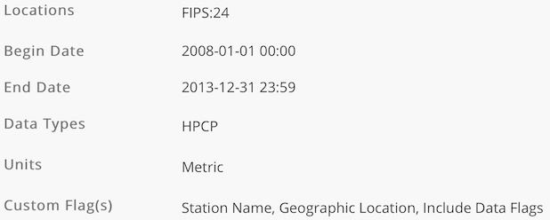

```{r setup, include=FALSE}
knitr::opts_chunk$set(echo = TRUE)
knitr::opts_chunk$set(eval = FALSE)
```

## Introduction

### The Question

Can we use precipitation data to predict the orthophosphate levels in bodies of water?

### Motivation

#### Orthophosphate

You are probably wondering:

* What is orthophosphate? (Sounds like a mouthful!)
* Why should I care about the orthophosphate levels in water?

Orthophosphate is known as reactive phosphate and is a main ingredient in fertilizer. Basically, this stuff makes living stuff grow; it's a nutrient that is "readily utilized by biota". When it rains, orthophosphates can get into bodies of water through run-off [@soltis-muth].

In biology terms, an excess of nutrients can lead to eutrophication. You should care because this phenomenon is something bad for the environment and humans.

#### Eutrophication

_Wth great nutrients comes a whole lot of algae. (And responsibility as I'll explain!)_

Wow, another big word in the title! Here is a brief simplified overview of what eutrophication is.

1) Nutrients causes growth of a lot of plants and algae who then die.
2) Bacteria decomposing the dead stuff use up all the oxygen which then **suffocates animals** in the water.

There are many other problems such as an increase in pH that is associated with algae blooms [@chislock_doster_zitomer_wilson_2013].

Let's backtrack. Nutrients in run-off that came from fertilizers played a part in this catastrophe. So be careful, mindful, and responsible when you use fertilizers!

Still not convinced to care? I conceed that I have not discussed how this affects humans.

* If you eat any kind of shellfish, you should definitely care. Some algae have toxins that make it into shellfish! [@shumway_1990]
* While cyanobacteria are not algae, it can be involved in a similar process with cyanobacteria blooms. This has been shown to cause an increase in "**non-alchoholic liver disease**" in humans! [@zhang_lee_liang_shum_2015]

#### What can we do?

* We have concluded that algae blooms can be bad for the environment and humans.
* We know there is a link between orthophosphate and algae growth.
* We know orthophosphate is found in fertilizers and run-off happens during rain.

My motivation for investigating _The Question_ is that: if we can predict orthophosphate levels using weather, perhaps we can limit the damaging effects of these blooms.

## Data Acquisition

### Finding Data

Getting data is no easy task for data scientists.

Often times if one has data, one has to clean or scrape that data. Other times one does not have data and has to spend hours finding suitable data. (Sometimes it is both.)

For this task, I spent many hours (possibly 6 or more) before I found data that was both good quality and was related to a good question!

At first I looked across different dataset repositories such as https://www.data.gov. I did not have any luck until I came across AWS open data: https://registry.opendata.aws.

Some candidate datasets I considered using were:

* eBird data
    * https://registry.opendata.aws/ebirdst/
    * https://cornelllabofornithology.github.io/ebirdst/
    * This is some data on birds.
    * This would be a good topic since birds play a very important role in the environment. They play a role in pollinating.
    * I found that this data was ready to use as a package was available in R already.
    * Some issues I ran into were that the data seemed mostly to be raster/image data. I was unsure how to manipulate these.
    * Also, the numerical data seemed to be related to model accuracy for some pre-defined model. Since I would like to analyze data itself, this would not be very helpful.

* Finnish (and HIRLAM) data
    * https://registry.opendata.aws/hirlam/
    * https://en.ilmatieteenlaitos.fi/open-data-on-aws-s3
    * From these links I eventually found some vague description of that the Finnish Meteorological Institute had time series data. That got me very excited.
    * After some digging, I found their catalog of data.
    * http://catalog.fmi.fi/geonetwork/srv/eng/catalog.search#/home
    * I mostly found dense XML data and was left confused.
    * Their website was, of course, primarily in Finnish. Setting the language to English and using Google Translate only helped a little. Maybe I should have looked at the data on AWS instead.

* Multimedia Commons (YFCC100M)
    * https://registry.opendata.aws/multimedia-commons/
    * https://multimediacommons.wordpress.com/yfcc100m-core-dataset/
    * The Multimedia Commons is an add-on dataset to the YFCC dataset. It provides pre-extracted features for images and audio.
    * We did not learn much about image processing. So this would be a great dataset to use as the features are ready to use. (They're actually still working on finishing the dataset.)
    * However, the original YFCC dataset required some kind of request for it. Since I did not want to wait, I did not choose this dataset.
    * Another issue was that many extracted features were in some LIRE format. I found it hard to understand the documentation.
    * And for features like SIFT not in this format, I struggled to find R libraries for image related machine learning. I would also have had to write a binary file parser in R.

Although AWS open data is a great place for data, the amount became overwhelming; I spent much of my time looking there. Unfortunately, I did not find any data of my liking.

These were just some of the datasets I found **not suitable**.

### The Data

I decided to search a bit more local. Perhaps the county or state government would have some good data. Indeed I found good data on Maryland's open data: https://opendata.maryland.gov.

I ended up settling with the **Water Point Source Sample** data:

https://opendata.maryland.gov/Energy-and-Environment/Water-Point-Source-Sample-Results/eqs6-savc

Now all I needed was precipitation data. Since I now knew exactly what I was looking for, I found it pretty quickly. I will also be using data from NOAA's Climate Data Online:

https://www.ncdc.noaa.gov/cdo-web/
https://www.ncdc.noaa.gov/cdo-web/datasets

The documentation can be found here:

https://www1.ncdc.noaa.gov/pub/data/cdo/documentation/PRECIP_HLY_documentation.pdf

This is a free dataset but we still have to "order" it. The steps to obtain this dataset are as follows:

1) Go to the search tool: https://www.ncdc.noaa.gov/cdo-web/search. Enter the following into the search form:
    * Precipitation Hourly
    * 2008-01-01 to 2013-12-31
    * States
    * Maryland
2) Submitting will take you to a map. Find the "add to cart" button on the left sidebar.
3) Hover over the cart on the right upper hand corner and click "go to cart".
4) Check everything is in order and click continue _until_ prompted for _station details/flags_. Since more data cannot hurt, check all the options (station name, geographic location, and data flags). **Make sure to switch the units from standard to metric.** (This actually requires some knowledge ahead of time. Our primary data is in metric.)
5) You definitely should check _Precipitation_ for data types. Click continue.
6) Again, check everything is in order, enter your email address and submit.
7) You will receive a link to download the data.



## Working With Data

Now that we have found the data, it is a good idea to load them. It will help in describing the data when the metadata is not clear.

### Required Packages

First, I will define what packages you'll need. It is helpful to know this at the start.

```{r import_stuff, warning=FALSE, message=FALSE}
# tibble related libraries
library(tidyverse)
library(tidyr)
# date processing
library(lubridate)
# string manipulation
library(stringr)
# map capabilities
library(leaflet)
```

### Loading Data

```{r loading_data}
m_types <- cols(
  `Org Name` = col_character(),
  `Station ID` = col_character(),
  County = col_character(),
  HUC = col_double(),
  `Station Horizontal Datum` = col_character(),
  `Activity ID` = col_character(),
  `Activity Start` = col_character(),
  `Activity Medium` = col_character(),
  `Activity Type` = col_character(),
  `Activity Category-Rep Num` = col_character(),
  `Characteristic Name` = col_character(),
  `Sample Fraction` = col_character(),
  `Value Type` = col_character(),
  `Result Value Status` = col_character(),
  `Result Value` = col_double(),
  Units = col_character(),
  `Analytical Proc ID` = col_character(),
  `Location 1` = col_character(),
  Counties = col_double()
)

water_stuff <- read_csv("Water_Point_Source_Sample_Results.csv", col_types = m_types)
```

```{r}
water_stuff <- water_stuff %>%
  mutate(the_date = mdy_hms(`Activity Start`))
```


## Description of Dataset
_TODO_

### Water Point Source Sample Results

* Org Name
* Station ID
* County
* HUC [see @usgs_water_2018]
    * Hydrologic Unit Code
    * You can think of this as a zipcode but for bodies of water.
    * This code is the concatentation of multiple codes. For example, the first two digits signify the "major geographical region" the water body is in. (For this dataset, a zero may need to be padded at the beginning for this to be true.)
* Station Horizontal Datum [@geodesy_2004]
    * This is the version of the geodetic datum being used. This has something to do with the shape of the Earth.
    * The system is a "collection of specific points on the Earth".
    * NAD27 is the outdated version and NAD83 is the newer version.
* Activity ID
* Activity Start
* Activity Medium
* Activity Type
* Activity Category-Rep Num
* Characteristic Name
* Sample Fraction
* Value Type
* Result Value Status
* Result Value
* Units 
* Analytical Proc ID
* Location 1
* Counties
    * This column was not included in the metadata. The name is vague.
    * To the best of my knowledge, it is safe to drop this column.

## Exploratory Data Analysis
_TODO_


```{r}
water_stuff %>% distinct(`Characteristic Name`)
```


```{r}
op_df <- water_stuff %>% filter(`Characteristic Name` == "Orthophosphate")
```

```{r}
op_df %>% distinct(`Station ID`)
```

```{r}
op_df %>% distinct(`County`)
```

```{r}
op_df %>% distinct(`Location 1`)
```

```{r}
op_df %>%
  distinct(`Location 1`, `Station ID`) %>%
  group_by(`Location 1`) %>%
  summarize(count = n()) %>%
  arrange(desc(count))
```

```{r}
op_df %>%
  filter(`Location 1` == "MARYLAND\n(38.583333, -77.157778)" |
           `Location 1` == "MARYLAND\n(39.359167, -76.370556)") %>%
  distinct(`Station ID`, `Location 1`)
```

```{r map_stuff, include=FALSE}
locations <- op_df %>%
  distinct(`Location 1`) %>%
  mutate(loc1 = str_sub(`Location 1`, start = 9)) %>%
  separate(loc1, c("lat","lng"), sep = ",") %>%
  mutate(lat=as.numeric(str_replace(lat, "\\(", ""))) %>%
  mutate(lng=as.numeric(str_replace(lng, "\\)", "")))

map <- leaflet(locations) %>%
  addTiles() %>%
  addMarkers(lng = ~lng, lat = ~lat, clusterOptions = markerClusterOptions())

map
```

```{r}
rain_stuff <- read_csv("precipitation.csv")

rain_stuff %>% head()
```

```{r}
rain_stuff %>% distinct(`STATION_NAME`)
```

```{r}
rain_stuff %>% distinct(LATITUDE, LONGITUDE)
```

```{r}
rain_stuff %>% distinct(LATITUDE, LONGITUDE, `STATION_NAME`)
```

```{r map_stuff2, include=FALSE}
tmp <- rain_stuff %>% distinct(LATITUDE, LONGITUDE)

rain_map <- leaflet(tmp) %>%
  addTiles() %>%
  addMarkers(lng = ~LONGITUDE, lat = ~LATITUDE, clusterOptions = markerClusterOptions())

rain_map
```

### Clustering

Note that it is very important to standardize the data.

```{r}
cluster_this <- op_df %>%
  mutate(loc1 = str_sub(`Location 1`, start = 9)) %>%
  separate(loc1, c("lat","lng"), sep = ",") %>%
  mutate(lat=as.numeric(str_replace(lat, "\\(", ""))) %>%
  mutate(lng=as.numeric(str_replace(lng, "\\)", ""))) %>%
  mutate(the_year = year(the_date))
```

```{r}
cluster_this <- cluster_this %>%
  group_by(the_year, lat, lng) %>%
  #mutate(region_year_avg = mean(`Result Value`)) %>%
  #ungroup() %>%
  summarize(region_year_avg = mean(`Result Value`)) %>%
  group_by(the_year) %>%
  mutate(year_mean = mean(region_year_avg),
         year_stdev = sd(region_year_avg)) %>%
  ungroup() %>%
  mutate(std_val = (region_year_avg - year_mean) / year_stdev)
  

  #select(lat, lng, `Result Value`) %>%
  #group_by(lat, lng) %>%
  # summarize(avg = mean(`Result Value`))
```

In this case I compute a non-weighted mean. This is because there is no real significance of one location having more data.

We are simply trying to do a scale to make the clustering work.

```{r}
lat_stats <- cluster_this %>% distinct(lat) %>% summarize(avg = mean(lat), stdev = sd(lat))
lng_stats <- cluster_this %>% distinct(lng) %>% summarize(avg = mean(lng), stdev = sd(lng))

cluster_this <- cluster_this %>%
  mutate(std_lat = (lat - lat_stats$avg) / lat_stats$stdev,
         std_lng = (lng - lng_stats$avg) / lng_stats$stdev)
```

```{r}
set.seed(1234)
x <- cluster_this %>%
  select(std_lat, std_lng, std_val) %>%
  cluster::clusGap(stats::kmeans, K.max=10)
x
```

```{r}
result <- x$Tab %>%
  as_tibble() %>%
  rowid_to_column("k")
```

```{r}
ggplot(result, mapping = aes(x = k, y = gap)) +
  geom_point() +
  geom_line() +
  geom_errorbar(mapping = aes(ymin = gap - SE.sim, ymax = gap + SE.sim))
```

```{r}
cluster::maxSE(x$Tab[ ,"gap"], x$Tab[ ,"SE.sim"],
      method = "Tibs2001SEmax",
      SE.factor = 1)
```

## Methods
_TODO_

## Results
_TODO_

## Conclusions
_TODO_

## References
